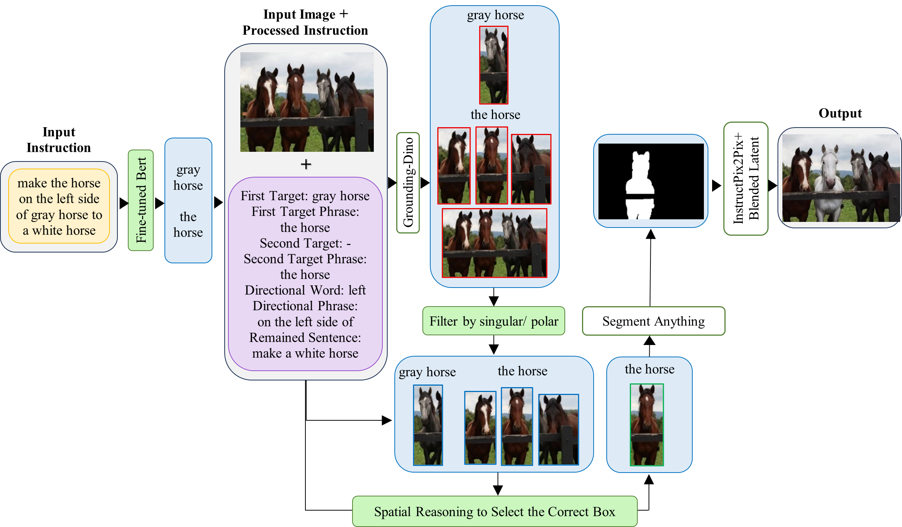
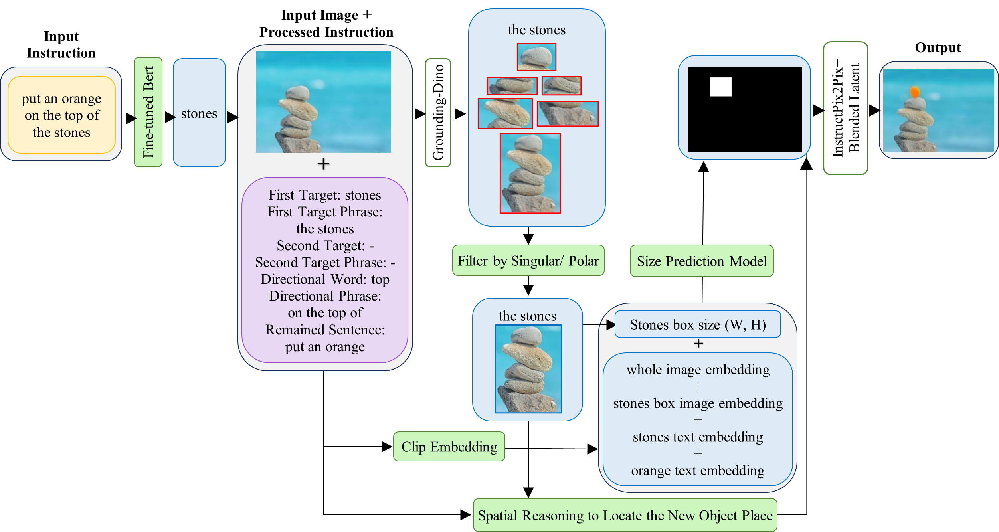
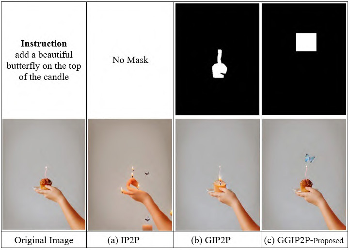
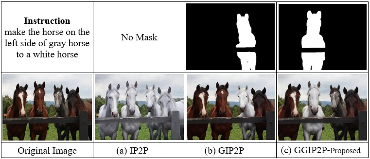
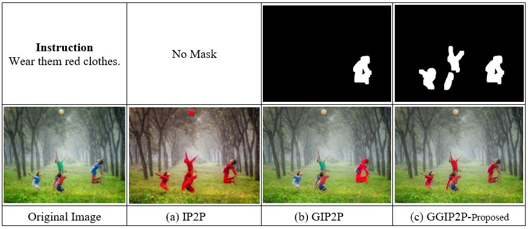

# Guided-Grounded-InstructPix2Pix (GGIP2P)

**Official PyTorch implementation of the paper "Guided-Grounded-InstructPix2Pix (GGIP2P): Instruction-Based Image Editing with Grounding and Mask Generation Control"** by zahra esmaily, Hossein Ebrahimpour-Komleh

  
  &nbsp;&nbsp;&nbsp;&nbsp;&nbsp;&nbsp;&nbsp;&nbsp;&nbsp;&nbsp;
  

  <em> multi-pass reasoning process for a relative instruction &nbsp;&nbsp;&nbsp;&nbsp;&nbsp;&nbsp;&nbsp;&nbsp;&nbsp;&nbsp;&nbsp;&nbsp;&nbsp;&nbsp;&nbsp;</em>
  <em>&nbsp;&nbsp;&nbsp;&nbsp;&nbsp;&nbsp;&nbsp;&nbsp;&nbsp;&nbsp;&nbsp;&nbsp;&nbsp;&nbsp;&nbsp; guided size prediction for an object generation instruction </em>

We introduce Guided-Grounded-InstructPix2Pix (GGIP2P), a novel pipeline that introduces a multi-step grounding and disambiguation process for instruction-based image editing. Our pipeline addresses the limitations of previous methods, which often struggle with complex instructions and the generation of new objects. GGIP2P operates through a multi-step process to ensure accurate target grounding and editing.

1. Instruction Disambiguation and Initial Target Identification:
This stage focuses on the linguistic processing of the instruction before it interacts with the image.

 * NER-based Target Detection: Using a fine-tuned BERT model with Low-Rank Adaptation (LoRA), we identify the main targets in the instruction by framing the problem as a Named Entity Recognition (NER) task. 
 * Pronoun Resolution: A dedicated mechanism replaces ambiguous pronouns (e.g., "her," "them") with concrete nouns to improve downstream detection.
 * Plurality and Directional Cue Extraction: We determine if the target is singular or plural and extract any spatial cues from the instruction.

2. Guided Target Grounding:
This stage details how we use the linguistic information to find and select the correct object(s) in the image.

 * Grounding with GroundingDINO: We use GroundingDINO to detect candidate objects based on the detected target noun phrases.
 * Plurality-Based Bounding Box Filtering: A filter refines these detections by keeping only the boxes that match the singular or plural nature of the target.
 * Spatial Reasoning: Our system uses directional cues to select the correct object from multiple candidates, handling both absolute ("the left car") and relative directions ("the lamp to the right of the bed").
 * Mask Generation: The final selected bounding box(es) are then used by the Segment Anything Model (SAM) to generate a high-quality pixel mask.

3. Guided Object Generation:
This is a specialized path that is triggered when the instruction requires adding a new object.

 * Size Prediction: When the instruction is to add a new object relative to an existing one, our size prediction model estimates the dimensions of the new object based on the reference object's size and contextual information. This model is trained on a custom dataset of co-planar objects to ensure realistic size relationships.
 * Mask Generation: A rectangular mask is automatically created at the correct location with the predicted size, providing precise guidance for the new object's placement.

4. Localized Image Editing
The final editing step uses a modified version of the InstructPix2Pix diffusion model. Following the approach of Grounded-InstructPix2Pix, it utilizes the latent blending technique proposed in Blended Latent Diffusion. The pipeline passes a simplified, direct instruction to the editing model, which removes confusing contextual information and enhances the semantic fidelity of the final edit.
This modular design enables GGIP2P to achieve superior performance in both instruction fidelity and background preservation while remaining computationally efficient.	

## Installation
You need to install the GroundingDINO model. You can do this by visiting [GroundingDINO](https://github.com/IDEA-Research/GroundingDINO).

We have also prepared a GroundingDINO folder for download. This folder must be in the root directory. you can download it from [here](https://drive.google.com/)

You also need download sam model 

You will need to :

	python -m pip install -e GroundingDINO
	python -m spacy download en_core_web_sm
	pip install diffusers transformers accelerate scipy safetensors
	pip install segment-anything
	pip install torchmetrics
	pip install git+https://github.com/openai/CLIP.git
	pip install transformers torch peft tqdm numpy scikit-learn

## Datasets & models
Download the pre-trained model from [here](https://drive.google.com/), and place it in the `"models"` directory

If you want to train models, you can download datasets from [here](https://drive.google.com/)

## Easy to use
To run our proposed pipline we provide a jupyter notebook:

	GGIP2P_pipline.ipynb

## Examples

  <table>
    <tr>
      <td>
          
	
IP2P stands for  InstructPix2Pix 
	 GIP2P stands for  Grounded-InstructPix2Pix 
	 GGIP2P stands for  Guided-Grounded-InstructPix2Pix

      </td>      
      <td>
         &nbsp; 
        
      </td>
    </tr>
  </table>

