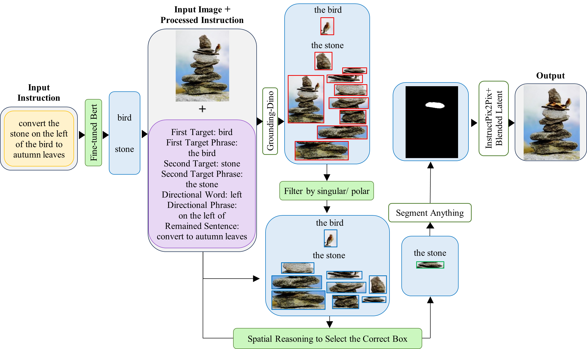

# GGIP2P

**Official PyTorch implementation of the paper "Guided-Grounded-InstructPix2Pix (GGIP2P): Instruction-Based Image Editing with Grounding and Mask Generation Control"** by zahra esmaily, Hossein Ebrahimpour-Komleh
# an example image

## About Guided-Grounded-InstructPix2Pix

  
  |	
  

Instruction-based image editing has emerged as an intuitive paradigm for image manipulation, yet state-of-the-art methods often struggle with precisely localizing edits, especially in complex scenes with ambiguous instructions. These models frequently fail when targets are referenced by pronouns, are part of a complex spatial relationship, or when distractor objects are present in the scene. Furthermore, they lack a mechanism for spatially guiding the generation of new objects that are not present in the original image. To address these limitations, we propose Guided-Grounded-Instruct-Pix2Pix (GGIP2P), a novel pipeline that introduces a multi-step grounding and disambiguation process. Our core contribution is a modular framework that deconstructs complex instructions through a series of specialized components. It begins with a highly accurate target detection module that frames the problem as a Named Entity Recognition (NER) task, leveraging a fine-tuned BERT model with LoRA. Building on this, our pipeline incorporates a pronoun resolution mechanism, a plurality-based bounding box filter, and a spatial reasoning module to handle absolute and relative directional cues. Crucially, we introduce a novel guided object generation capability, powered by a size prediction model that estimates the dimensions of an absent object relative to an existing one, enabling precise, mask-guided placement. Through comprehensive qualitative and quantitative evaluations, we demonstrate that our method significantly outperforms existing approaches in handling complex, real-world instructions, achieving superior performance in both instruction fidelity and background preservation.

## Installation
to install GroundingDINO:

	git clone https://github.com/IDEA-Research/GroundingDINO.git
	cd GroundingDINO
	python setup.py install
	
	mkdir weights
	cd weights
	wget https://github.com/IDEA-Research/GroundingDINO/releases/download/v0.1.0-alpha/groundingdino_swint_ogc.pth
	cd ../../

You will need to :

	python -m pip install -e segment_anything
	python -m pip install -e GroundingDINO
	python -m spacy download en_core_web_sm
	pip install diffusers transformers accelerate scipy safetensors
	pip install segment-anything
	pip install torchmetrics
	pip install git+https://github.com/openai/CLIP.git
	pip install transformers torch peft tqdm numpy scikit-learn

To run our model we provide a jupyter notebook:
Download the pre-trained model from [here](https://drive.google.com/), and place it in the `"pretrained_models/bert"` directory

	guided_grounded-instruct-pix2pix.ipynb

## Examples
